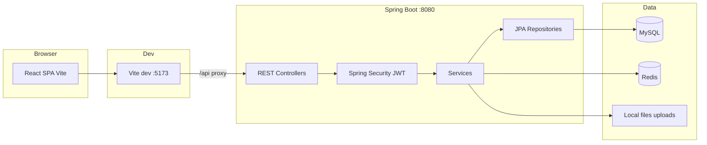
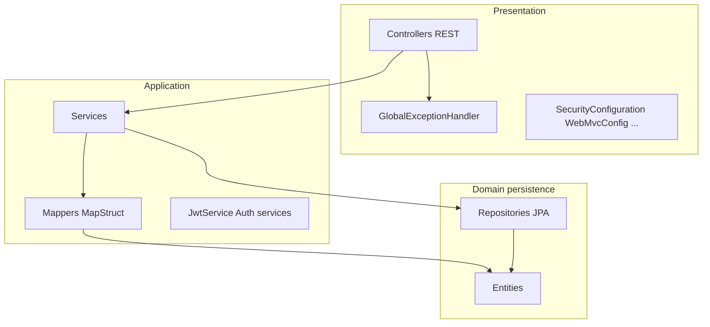
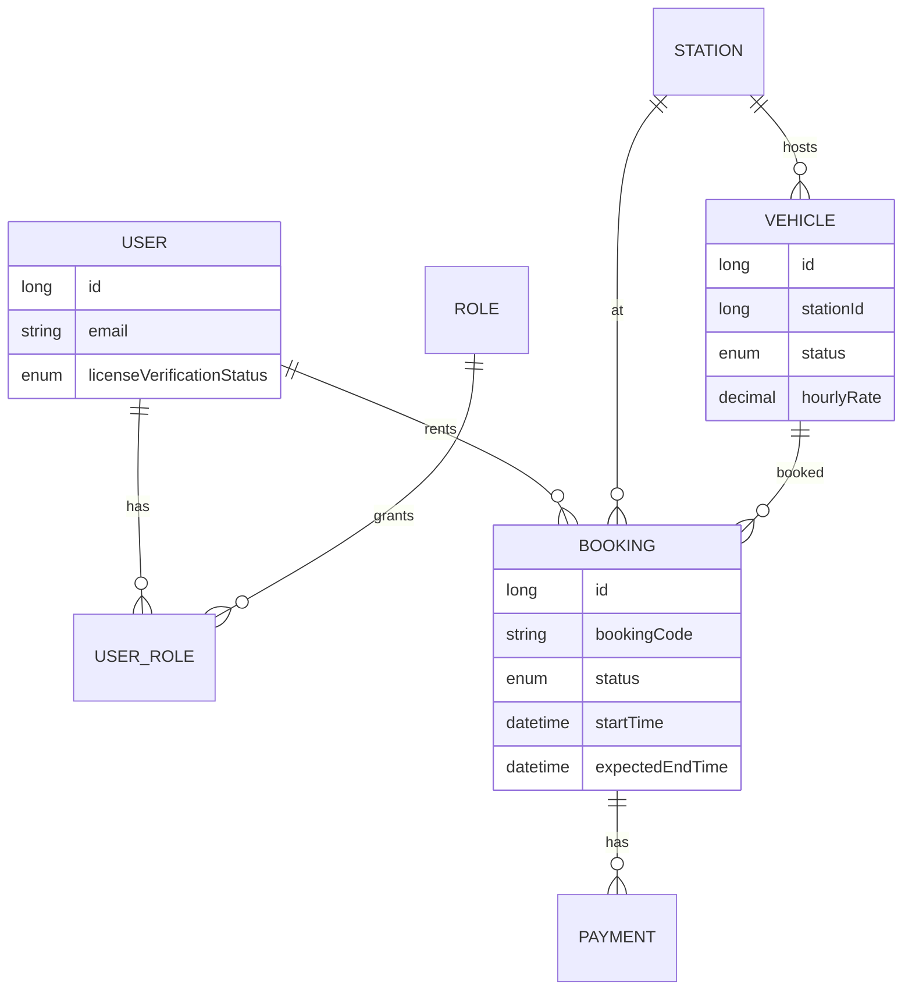
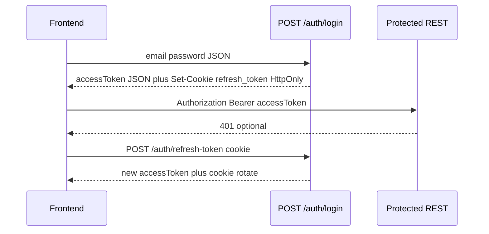
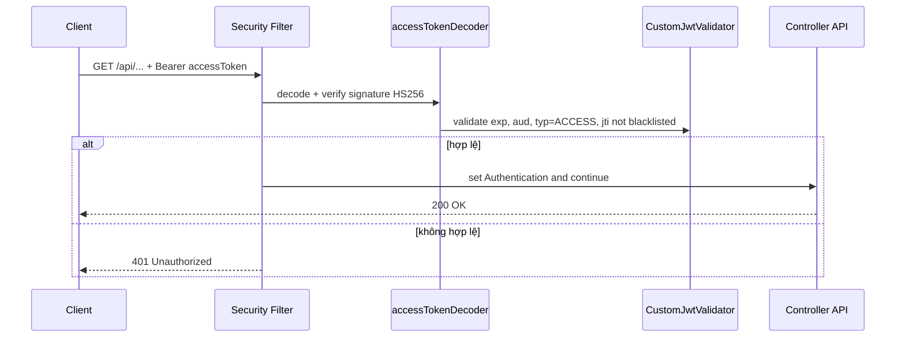
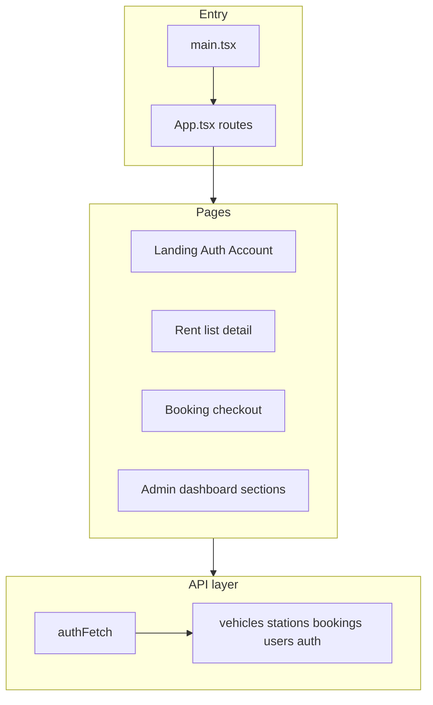
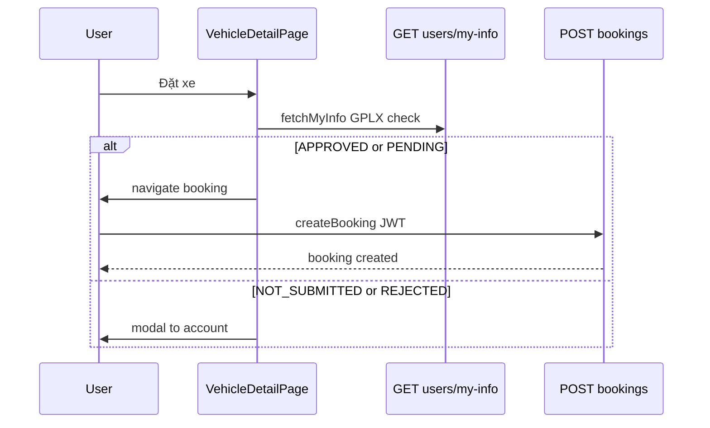

# UngDungGoiXe — Kiến trúc hệ thống

**Mục đích:** Tài liệu kiến trúc kỹ thuật để **phiên Cursor / agent mới** nắm cấu trúc tổng thể, luồng dữ liệu và ranh giới module — **đọc cùng [`plan.md`](./plan.md)** (`plan.md` tập trung stack, route, quy tắc nghiệp vụ ngắn).

---

## 1. Bối cảnh tổng thể (C4 — mức hệ thống)

- **Production / build:** SPA build ra static files có thể phục vụ qua Spring hoặc CDN; dev dùng proxy như trong `frontend/vite.config.ts`.
- **API quy ước:** Frontend gọi **`/api/...`** → Vite rewrite thành **`/...`** trên backend.

---

## 2. Tầng backend (Spring)

| Package / nhóm | Trách nhiệm |
|------------------|-------------|
| `controller` | HTTP, DTO in/out, không chứa nghiệp vụ dài |
| `service` | Luồng nghiệp vụ, giao dịch `@Transactional`, gọi repo |
| `repository` | Spring Data JPA, query tùy chỉnh khi cần |
| `entity` | JPA model, quan hệ |
| `dto/request`, `dto/response` | Hợp đồng JSON |
| `mapper` | MapStruct entity ↔ DTO |
| `configuration` | Security filter chain, JWT converter, Redis, static files |
| `exception` | `AppException`, xử lý lỗi chuẩn hóa `ApiResponse` |

---

## 3. Mô hình dữ liệu cốt lõi (rút gọn)

- **Booking** gắn **renter** (`User`), **vehicle**, **station**; trạng thái và tiền xử lý trong `BookingService`.
- **Payment** gắn booking (chi tiết xem entity/DTO).

---

## 4. Kiến trúc bảo mật (hai luồng)

- **Đăng nhập:** `AuthenticationFilter` (Spring Security 7) + **JWT Resource Server** cho các request có Bearer token.
- **Phân quyền:** JWT claim **`roles`** → `JwtGrantedAuthoritiesConverter` (prefix rỗng); frontend `RequireAdmin` so khớp nhiều biến thể tên role.

Chi tiết matcher `permitAll` / `authenticated`: xem `SecurityConfiguration` trong repo và mục tương ứng trong `plan.md`.

### Sequence ngắn: Validate Access Token

### Security learning flow (chi tiết dễ học)

Mục này là bản “đọc nhanh 1 lần là nắm luồng” cho các file auth/security.

#### 1) Login: tạo Access + Refresh

- **Entry point:** `AuthenticationController.login()` gọi `AuthenticationService.authenticate()`.
- Frontend gửi `POST /auth/login` (`frontend/src/api/auth.ts`).
- Backend dùng `AuthenticationManager` + `DaoAuthenticationProvider` + `UserDetailsServiceImpl` để xác thực email/password.
- Khi hợp lệ:
  - `JwtService.generateAccessToken()` tạo token loại **ACCESS** (`typ=ACCESS`) với claim quan trọng: `sub`, `roles`, `aud`, `jti`, `exp` (~1h).
  - `JwtService.generateRefreshToken()` tạo token loại **REFRESH** (`typ=REFRESH`) với `jti`, `aud`, `exp` (~14 ngày).
  - `TokenService.saveRefreshToken()` lưu `jti` refresh vào Redis (`refresh_token`) như whitelist phiên hợp lệ.
- Response trả:
  - `accessToken` trong JSON.
  - cookie HttpOnly `refresh_token` (set ở controller).

#### 2) Validate Access Token cho API protected

- **Cấu hình chính:** `SecurityConfiguration` + `JwtConfiguration` + `CustomJwtValidator`.
- Mọi route không `permitAll()` đi qua OAuth2 Resource Server JWT filter.
- Bean `accessTokenDecoder` sẽ:
  - verify chữ ký HS256.
  - check mặc định timestamp (`JwtValidators.createDefault()`).
  - check custom (`CustomJwtValidator`):
    - `aud` phải khớp `jwt.audience`.
    - `typ` bắt buộc là `ACCESS`.
    - phải có `jti`.
    - `jti` không nằm trong Redis blacklist (`blacklist_token`).
- Fail ở bước nào cũng trả `401`.

#### 3) Refresh Token: rotate để chống replay

- **Entry point:** `AuthenticationController.refreshToken()` gọi `AuthenticationService.refreshToken()`.
- Frontend gọi `POST /auth/refresh-token` với cookie `refresh_token` (do `authFetch` tự gọi khi gặp 401).
- Service thực hiện:
  1. parse + verify chữ ký refresh token (Nimbus `MACVerifier`).
  2. check hết hạn.
  3. đọc `jti` và kiểm tra tồn tại trong Redis whitelist (`findRefreshByJti`).
  4. kiểm tra token thuộc đúng user.
  5. phát access token mới.
  6. **rotate refresh token:** xóa refresh cũ (`deleteRefreshToken(jti)`), tạo refresh mới, lưu Redis, set cookie mới.
- Ý nghĩa: mỗi refresh token chỉ dùng 1 lần, giảm nguy cơ replay.

#### 4) Logout: vô hiệu hóa cả refresh lẫn access

- **Entry point:** `AuthenticationController.logout()` gọi `AuthenticationService.logOut()`.
- Client gửi:
  - `Authorization: Bearer <accessToken>`
  - cookie `refresh_token` (nếu còn).
- Service xử lý:
  1. validate refresh token (`TokenType.REFRESH`) rồi xóa `jti` khỏi whitelist Redis.
  2. validate access token (`TokenType.ACCESS`) rồi đưa `jti` vào blacklist Redis tới lúc token hết hạn.
- Controller set cookie refresh rỗng (`maxAge=0`) để trình duyệt xóa.
- Sau logout:
  - refresh cũ không dùng lại được.
  - access cũ bị chặn ngay nhờ check blacklist.

#### 5) Frontend auto-recover session (401 -> refresh -> retry)

- File chính: `frontend/src/api/authFetch.ts`.
- Luồng:
  1. Gắn Bearer access token từ `localStorage`.
  2. Nếu response là 401 -> gọi `refreshAccessToken()`.
  3. refresh thành công -> lưu access token mới -> retry request cũ.
  4. refresh fail -> xóa session local + redirect `/auth`.

#### 6) Thứ tự đọc code khuyến nghị

1. `configuration/SecurityConfiguration.java`
2. `configuration/JwtConfiguration.java`
3. `security/CustomJwtValidator.java`
4. `service/JwtService.java`
5. `service/AuthenticationService.java`
6. `service/TokenService.java`
7. `controller/AuthenticationController.java`
8. `frontend/src/api/authFetch.ts` và `frontend/src/api/auth.ts`

#### 7) Ghi chú debug quan trọng

- Redis dùng 2 “kho logic”:
  - `refresh_token`: whitelist refresh token còn hiệu lực.
  - `blacklist_token`: access token đã logout.
- `typ` claim là điểm phân biệt ACCESS / REFRESH.
- `aud` claim bị check custom; mismatch audience sẽ ra 401.
- Khi thay matcher trong `SecurityConfiguration`, chú ý thứ tự `requestMatchers(...)` để tránh mở nhầm endpoint private.

---

## 5. Kiến trúc frontend (SPA)

- **Router:** mọi URL trong `App.tsx` (xem bảng trong `plan.md`).
- **Trạng thái đăng nhập:** `localStorage` + (tuỳ trang) `fetchMyInfo` cho dữ liệu nhạy cảm như GPLX.
- **Gate GPLX (thuê xe):** logic `isLicenseApprovedForRent` — cho **APPROVED** và **PENDING**; UI `LicenseRequiredModal` khi chặn.

---

## 6. Luồng nghiệp vụ: đặt xe (happy path)

- Kiểm tra lịch trống: `GET /bookings/vehicle-availability` (public) — frontend debounce; backend vẫn kiểm tra khi tạo booking.

---

## 7. Cấu hình & triển khai

| Thành phần | Ghi chú |
|------------|---------|
| `application.yaml` | Datasource, Redis, JWT env, multipart, `app.upload-dir` |
| `schema-mysql.sql` | Bổ sung cột / an toàn với `continue-on-error` |
| Env | `JWT_SECRET`, `JWT_AUDIENCE` bắt buộc cho JWT |

---

## 8. Gợi ý khi mở rộng

- Thêm endpoint: cập nhật **`SecurityConfiguration`** trước khi kỳ vọng gọi từ FE anonymous.
- Thay đổi giá booking: đồng bộ **`BookingService#calculateBasePrice`** và **`computeBookingEstimate`** (frontend).
- Tách microservice: ranh giới tự nhiên hiện tại là **monolith theo package**; tách trước hết có thể là **file storage** hoặc **notification**.

---

## 9. Changelog (kiến trúc)

- **2026-04-20:** Thêm mục “Security learning flow” chi tiết (login/validate/refresh/logout/frontend retry).
- **2026-04-20:** Thêm sequence cực ngắn cho luồng validate access token.
- **2026-04-20:** Khởi tạo `architecture.md` — sơ đồ context, tầng backend, ER rút gọn, security, FE layers, sequence đặt xe.
