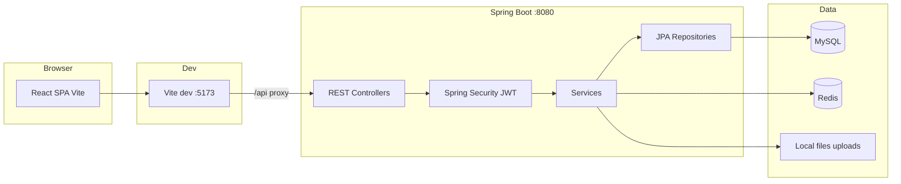
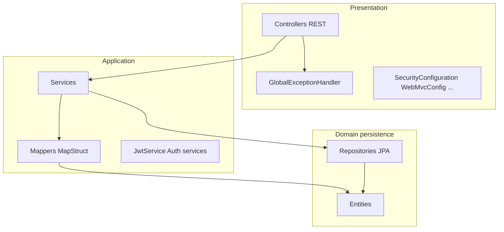
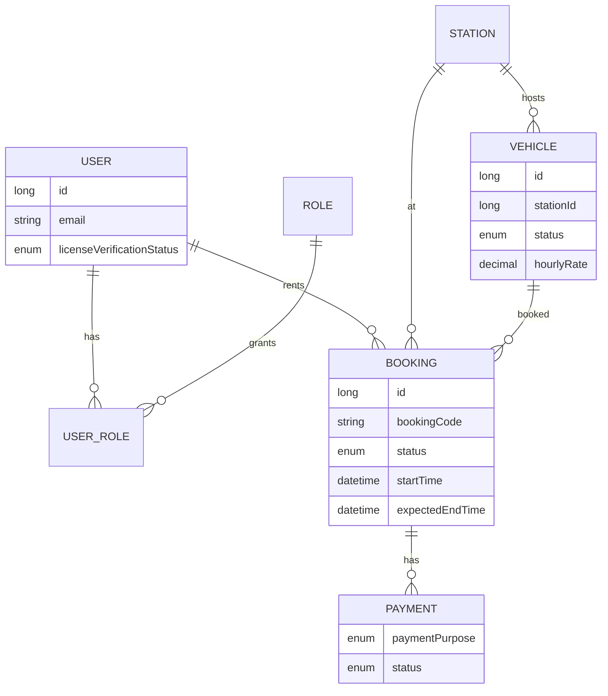
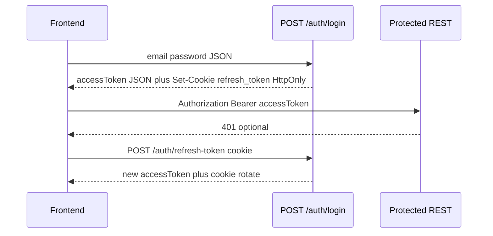
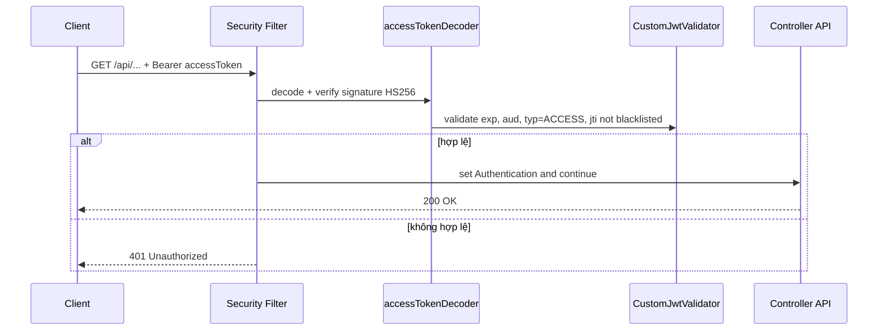
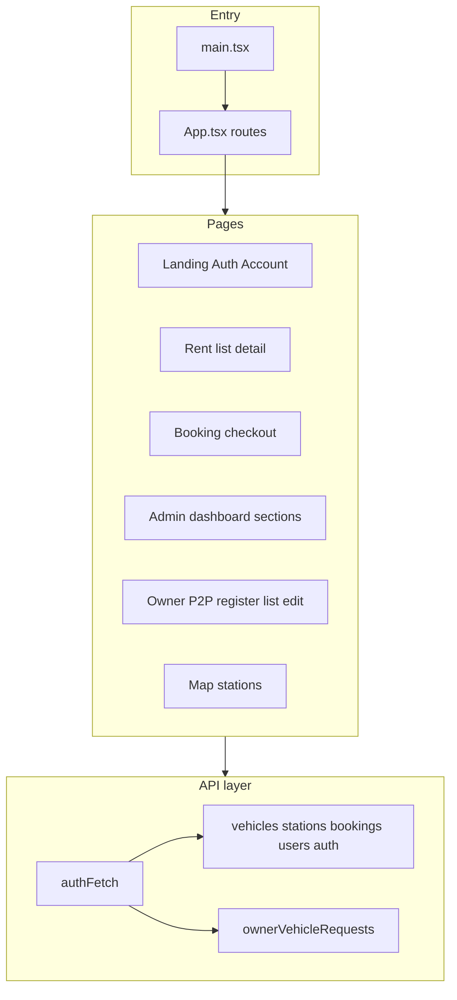
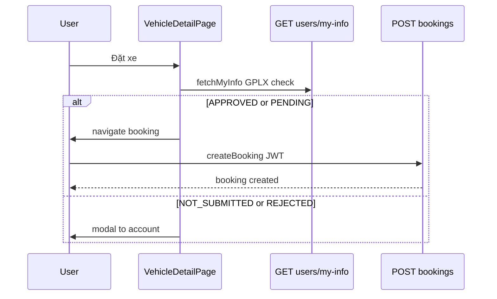
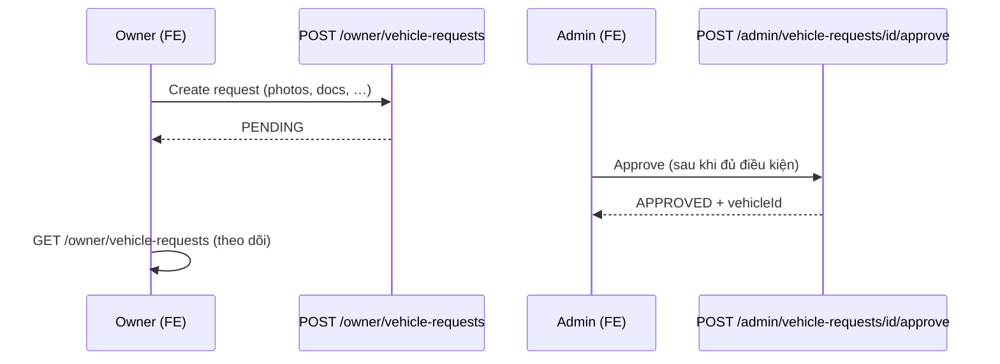
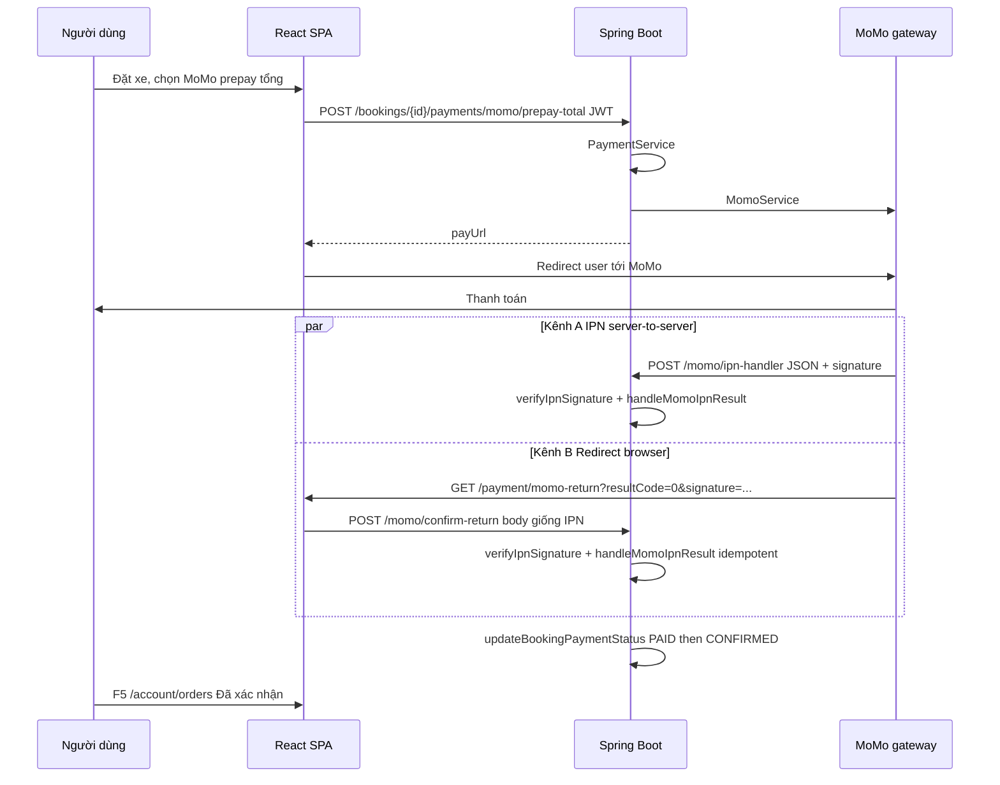
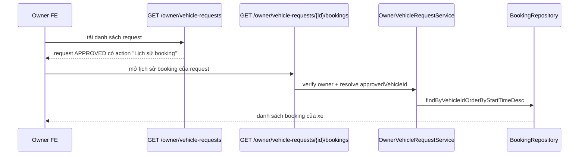

# UngDungGoiXe — Kiến trúc hệ thống

**Mục đích:** Tài liệu kiến trúc kỹ thuật để **phiên Cursor / agent mới** nắm cấu trúc tổng thể, luồng dữ liệu và ranh giới module — **đọc cùng [`plan.md`](./plan.md)** (`plan.md` tập trung stack, route, quy tắc nghiệp vụ ngắn).

---

## 1. Bối cảnh tổng thể (C4 — mức hệ thống)



- **Production / build:** SPA build ra static files có thể phục vụ qua Spring hoặc CDN; dev dùng proxy như trong `frontend/vite.config.ts`.
- **API quy ước:** Frontend gọi **`/api/...`** → Vite rewrite thành **`/...`** trên backend.

---

## 2. Tầng backend (Spring)



| Package / nhóm | Trách nhiệm |
|------------------|-------------|
| `controller` | HTTP, DTO in/out, không chứa nghiệp vụ dài |
| `service` | Luồng nghiệp vụ, giao dịch `@Transactional`, gọi repo |
| `repository` | Spring Data JPA, query tùy chỉnh khi cần |
| `entity` | JPA model, quan hệ |
| `dto/request`, `dto/response` | Hợp đồng JSON |
| `mapper` | MapStruct entity ↔ DTO |
| `configuration` | Security filter chain, JWT converter, Redis, static files |
| `exception` | `AppException`, xử lý lỗi chuẩn hóa `ApiResponse` |

---

## 3. Mô hình dữ liệu cốt lõi (rút gọn)



- **Booking** gắn **renter** (`User`), **vehicle**, **station**; trạng thái và tiền xử lý trong `BookingService`.
- **Payment** gắn booking; có **`paymentPurpose`** (`DEPOSIT`, `PREPAID_TOTAL`, `TOPUP`, `REFUND`) để phân luồng MoMo prepay, cọc, và điều chỉnh sau khi trả xe (xem mục Thanh toán).

---

## 4. Kiến trúc bảo mật (hai luồng)



- **Đăng nhập:** `AuthenticationFilter` (Spring Security 7) + **JWT Resource Server** cho các request có Bearer token.
- **Phân quyền:** JWT claim **`roles`** → `JwtGrantedAuthoritiesConverter` (prefix rỗng); frontend `RequireAdmin` so khớp nhiều biến thể tên role.

Chi tiết matcher `permitAll` / `authenticated`: xem `SecurityConfiguration` trong repo và mục tương ứng trong `plan.md`.

### Sequence ngắn: Validate Access Token



### Security learning flow (chi tiết dễ học)

Mục này là bản “đọc nhanh 1 lần là nắm luồng” cho các file auth/security.

#### 1) Login: tạo Access + Refresh

- **Entry point:** `AuthenticationController.login()` gọi `AuthenticationService.authenticate()`.
- Frontend gửi `POST /auth/login` (`frontend/src/api/auth.ts`).
- Backend dùng `AuthenticationManager` + `DaoAuthenticationProvider` + `UserDetailsServiceImpl` để xác thực email/password.
- Khi hợp lệ:
  - `JwtService.generateAccessToken()` tạo token loại **ACCESS** (`typ=ACCESS`) với claim quan trọng: `sub`, `roles`, `aud`, `jti`, `exp` (~1h).
  - `JwtService.generateRefreshToken()` tạo token loại **REFRESH** (`typ=REFRESH`) với `jti`, `aud`, `exp` (~14 ngày).
  - `TokenService.saveRefreshToken()` lưu `jti` refresh vào Redis (`refresh_token`) như whitelist phiên hợp lệ.
- Response trả:
  - `accessToken` trong JSON.
  - cookie HttpOnly `refresh_token` (set ở controller).

#### 2) Validate Access Token cho API protected

- **Cấu hình chính:** `SecurityConfiguration` + `JwtConfiguration` + `CustomJwtValidator`.
- Mọi route không `permitAll()` đi qua OAuth2 Resource Server JWT filter.
- Bean `accessTokenDecoder` sẽ:
  - verify chữ ký HS256.
  - check mặc định timestamp (`JwtValidators.createDefault()`).
  - check custom (`CustomJwtValidator`):
    - `aud` phải khớp `jwt.audience`.
    - `typ` bắt buộc là `ACCESS`.
    - phải có `jti`.
    - `jti` không nằm trong Redis blacklist (`blacklist_token`).
- Fail ở bước nào cũng trả `401`.

#### 3) Refresh Token: rotate để chống replay

- **Entry point:** `AuthenticationController.refreshToken()` gọi `AuthenticationService.refreshToken()`.
- Frontend gọi `POST /auth/refresh-token` với cookie `refresh_token` (do `authFetch` tự gọi khi gặp 401).
- Service thực hiện:
  1. parse + verify chữ ký refresh token (Nimbus `MACVerifier`).
  2. check hết hạn.
  3. đọc `jti` và kiểm tra tồn tại trong Redis whitelist (`findRefreshByJti`).
  4. kiểm tra token thuộc đúng user.
  5. phát access token mới.
  6. **rotate refresh token:** xóa refresh cũ (`deleteRefreshToken(jti)`), tạo refresh mới, lưu Redis, set cookie mới.
- Ý nghĩa: mỗi refresh token chỉ dùng 1 lần, giảm nguy cơ replay.

#### 4) Logout: vô hiệu hóa cả refresh lẫn access

- **Entry point:** `AuthenticationController.logout()` gọi `AuthenticationService.logOut()`.
- Client gửi:
  - `Authorization: Bearer <accessToken>`
  - cookie `refresh_token` (nếu còn).
- Service xử lý:
  1. validate refresh token (`TokenType.REFRESH`) rồi xóa `jti` khỏi whitelist Redis.
  2. validate access token (`TokenType.ACCESS`) rồi đưa `jti` vào blacklist Redis tới lúc token hết hạn.
- Controller set cookie refresh rỗng (`maxAge=0`) để trình duyệt xóa.
- Sau logout:
  - refresh cũ không dùng lại được.
  - access cũ bị chặn ngay nhờ check blacklist.

#### 5) Frontend auto-recover session (401 -> refresh -> retry)

- File chính: `frontend/src/api/authFetch.ts`.
- Luồng:
  1. Gắn Bearer access token từ `localStorage`.
  2. Nếu response là 401 -> gọi `refreshAccessToken()`.
  3. refresh thành công -> lưu access token mới -> retry request cũ.
  4. refresh fail -> xóa session local + redirect `/auth`.

#### 6) Thứ tự đọc code khuyến nghị

1. `configuration/SecurityConfiguration.java`
2. `configuration/JwtConfiguration.java`
3. `security/CustomJwtValidator.java`
4. `service/JwtService.java`
5. `service/AuthenticationService.java`
6. `service/TokenService.java`
7. `controller/AuthenticationController.java`
8. `frontend/src/api/authFetch.ts` và `frontend/src/api/auth.ts`

#### 7) Ghi chú debug quan trọng

- Redis dùng 2 “kho logic”:
  - `refresh_token`: whitelist refresh token còn hiệu lực.
  - `blacklist_token`: access token đã logout.
- `typ` claim là điểm phân biệt ACCESS / REFRESH.
- `aud` claim bị check custom; mismatch audience sẽ ra 401.
- Khi thay matcher trong `SecurityConfiguration`, chú ý thứ tự `requestMatchers(...)` để tránh mở nhầm endpoint private.

---

## 5. Kiến trúc frontend (SPA)



- **Router:** mọi URL trong `App.tsx` (xem bảng trong `plan.md`).
- **Owner cho thuê (P2P):** `/owner/register-vehicle`, `/owner/vehicle-requests`, `/owner/vehicle-requests/:id/edit` — gọi API qua `ownerVehicleRequests.ts`, form dùng chung helper `lib/ownerVehicleRequestForm.ts`.
- **Trạng thái đăng nhập:** `localStorage` + (tuỳ trang) `fetchMyInfo` cho dữ liệu nhạy cảm như GPLX.
- **Gate GPLX (thuê xe):** logic `isLicenseApprovedForRent` — cho **APPROVED** và **PENDING**; UI `LicenseRequiredModal` khi chặn.
- **Thanh toán MoMo (return):** **`/payment/momo-return`** — `MomoReturnPage.tsx` (query MoMo, UI kết quả); đồng bộ DB qua **`momoConfirm.ts`** → backend **`POST /momo/confirm-return`** (bổ trợ / thay IPN khi dev).
- **API thanh toán (FE):** `frontend/src/api/payments.ts` — pending adjustments, xác nhận TOPUP/REFUND (admin).
- **Admin điều chỉnh tiền:** tab TOPUP / REFUND trong `AdminBookingsSection.tsx` (kèm tìm kiếm cục bộ theo id thanh toán, booking, mã booking, transaction id).

---

## 6. Luồng nghiệp vụ: đặt xe (happy path)



- Kiểm tra lịch trống: `GET /bookings/vehicle-availability` (public) — frontend debounce; backend vẫn kiểm tra khi tạo booking.

---

## 7. Cấu hình & triển khai

| Thành phần | Ghi chú |
|------------|---------|
| `application.yaml` | Datasource, Redis, JWT env, multipart, `app.upload-dir`, **`momo.*`** (return-url trỏ SPA sau thanh toán, ipn-url), **`springdoc.swagger-ui.path`** |
| `schema-mysql.sql` | Bổ sung cột / an toàn với `continue-on-error` |
| Env | `JWT_SECRET`, `JWT_AUDIENCE` bắt buộc cho JWT |

---

## 8. Gợi ý khi mở rộng

- Thêm endpoint: cập nhật **`SecurityConfiguration`** trước khi kỳ vọng gọi từ FE anonymous.
- Thay đổi giá booking: đồng bộ **`BookingService#calculateBasePrice`** và **`computeBookingEstimate`** (frontend).
- Tách microservice: ranh giới tự nhiên hiện tại là **monolith theo package**; tách trước hết có thể là **file storage** hoặc **notification**.

---

## 9. Trạm (Station) — tọa độ & bản đồ

**Mục đích:** lưu tọa độ WGS84 (nullable) để vẽ marker trên bản đồ và hỗ trợ admin chỉnh tay.

| Thành phần | Ghi chú |
|------------|---------|
| **DB** | Bảng `stations`: cột `latitude`, `longitude` (`DOUBLE NULL`). Migration / idempotent: `schema-mysql.sql`. Seed: `src/main/resources/db/seed.sql` (cập nhật tọa độ mẫu). |
| **Backend** | `Station` entity + DTO (`StationResponse`, `CreateStationRequest`, `UpdateStationRequest`). `UpdateStationRequest.clearCoordinates` + `StationService.updateStation` xử lý xóa tọa độ (MapStruct bỏ qua `null`). |
| **API** | `GET /stations` (và các endpoint station khác) trả thêm `latitude`, `longitude`. |
| **Admin FE** | `AdminStationsSection.tsx` — nhập/sửa lat/lng, cột hiển thị, gửi `clearCoordinates` khi xóa. |
| **Bản đồ FE** | Route `/mapstation` — `MapStationPage.tsx` + `MapStationPage.css`. Loader tập trung: `lib/googleMapsLoader.ts` (`@googlemaps/js-api-loader`), đọc `import.meta.env.VITE_GOOGLE_MAPS_API_KEY`, tùy chọn `VITE_GOOGLE_MAP_ID`. Tách khỏi trang thuê xe: `CarRentalPage` / `VehicleBookingPage` không nhúng map (tránh lỗi import / Strict Mode). |
| **API client** | `frontend/src/api/stations.ts` — type `StationDto` + payload cập nhật có `latitude`, `longitude`, `clearCoordinates`. |

---

## 10. Luồng P2P: **Owner Vehicle Request** (chủ xe đăng ký cho thuê — admin duyệt)

Đây là luồng **tách biệt** khỏi `Vehicle` / `Booking` cho đến khi admin **duyệt**: dữ liệu nằm ở bảng request, sau `APPROVED` mới tạo bản ghi `Vehicle` thật và gắn `approved_vehicle_id`.

### 10.1 Trạng thái (`OwnerVehicleRequestStatus`)

| Giá trị | Ý nghĩa ngắn |
|---------|----------------|
| `PENDING` | Chờ admin xử lý |
| `NEED_MORE_INFO` | Admin yêu cầu bổ sung (có `adminNote`) |
| `APPROVED` | Đã tạo xe trong hệ thống, có `approvedVehicleId` |
| `REJECTED` | Từ chối |
| `CANCELLED` | Hủy (ít dùng trong MVP) |

### 10.2 Mô hình dữ liệu & persistence

- **Entity:** `entity/OwnerVehicleRequest.java` — FK `owner` → `User`, `station` → `Station`, tùy chọn `approvedVehicle` → `Vehicle`; thông tin xe (biển số, tên, hãng, nhiên liệu, chỗ, giá, cọc, mô tả, địa chỉ, lat/lng), URL giấy đăng ký / bảo hiểm, `status`, `adminNote`, timestamp.
- **Collection tables:** `owner_vehicle_request_photos` (URL ảnh), `owner_vehicle_request_policies` (chuỗi điều khoản).
- **Schema:** định nghĩa trong `src/main/resources/schema-mysql.sql` (bảng + collection).

```mermaid
erDiagram
  USER ||--o{ OWNER_VEHICLE_REQUEST : submits
  STATION ||--o{ OWNER_VEHICLE_REQUEST : pickup_station
  OWNER_VEHICLE_REQUEST }o--|| VEHICLE : approved_as
  OWNER_VEHICLE_REQUEST {
    long id
    string license_plate
    enum status
    long approved_vehicle_id FK_null
  }
```

### 10.3 Quy tắc nghiệp vụ (backend — `OwnerVehicleRequestService`)

| Quy tắc | Chi tiết |
|---------|-----------|
| **Biển số** | Chuẩn hóa trim + upper; không trùng với xe đã có (`VehicleRepository.existsByLicensePlate`) và không trùng request đang chặn (`PENDING`, `NEED_MORE_INFO`, `APPROVED`) — ngoại trừ chính request khi **update** đổi biển. |
| **Bộ dữ liệu tối thiểu** | Trước khi **tạo**, **cập nhật**, **resubmit** (về `PENDING`) và trước khi **admin approve**: ít nhất **3** URL ảnh (sau trim, bỏ dòng trống); **bắt buộc** URL giấy đăng ký + bảo hiểm (trim, không rỗng). Lỗi: `OWNER_VEHICLE_REQUEST_PHOTOS_INSUFFICIENT` (3006), `OWNER_VEHICLE_REQUEST_DOCS_REQUIRED` (3007). |
| **Create** | User hiện tại + `stationId` hợp lệ → `PENDING`. |
| **Update (`PUT /owner/vehicle-requests/{id}`)** | Chỉ owner của request; chỉ khi `PENDING` hoặc `NEED_MORE_INFO`. |
| **Resubmit (`POST .../resubmit`)** | Chỉ `REJECTED` hoặc `NEED_MORE_INFO` → `PENDING`, xóa `adminNote`; validate đủ ảnh + giấy tờ trước khi đổi trạng thái. |
| **Admin approve** | Chỉ từ `PENDING` / `NEED_MORE_INFO`; validate đủ ảnh + giấy tờ; tạo `Vehicle` (copy field phù hợp), gắn FK approved. |
| **Admin reject / need-more-info** | Theo `AdminOwnerVehicleRequestController` + `OwnerVehicleRequestService` (need-more-info hiện chỉ từ `PENDING` — xem code). |

**Mã lỗi liên quan:** `OWNER_VEHICLE_REQUEST_NOT_FOUND` (3003), `OWNER_VEHICLE_REQUEST_STATUS_INVALID` (3004), `OWNER_VEHICLE_REQUEST_INVALID` (3005), cộng 3006–3007 ở trên. Dùng chung `VEHICLE_LICENSE_PLATE_ALREADY_EXISTS` (3002) khi trùng biển.

### 10.4 API REST (tóm tắt)

| Phương thức & path | Vai trò | Bảo vệ |
|--------------------|---------|--------|
| `POST /owner/vehicle-requests` | Tạo request | JWT, authenticated |
| `GET /owner/vehicle-requests` | Danh sách của tôi | JWT |
| `GET /owner/vehicle-requests/{id}` | Chi tiết một request (của tôi) | JWT |
| `PUT /owner/vehicle-requests/{id}` | Cập nhật | JWT |
| `POST /owner/vehicle-requests/{id}/resubmit` | Gửi lại | JWT |
| `GET /admin/vehicle-requests?status=` | Admin lọc theo status | Role admin (xem controller) |
| `GET /admin/vehicle-requests/{id}` | Chi tiết admin | Admin |
| `POST /admin/vehicle-requests/{id}/approve` | Duyệt (+ body `adminNote` tùy chọn) | Admin |
| `POST /admin/vehicle-requests/{id}/reject` | Từ chối | Admin |
| `POST /admin/vehicle-requests/{id}/need-more-info` | Cần bổ sung | Admin |

Controller: `OwnerVehicleRequestController`, `AdminOwnerVehicleRequestController`. DTO: `CreateOwnerVehicleRequest`, `UpdateOwnerVehicleRequest`, `AdminReviewOwnerVehicleRequest`, `OwnerVehicleRequestResponse`. MapStruct: `OwnerVehicleRequestMapper`. Repo: `OwnerVehicleRequestRepository`.

### 10.5 Frontend

| Khu vực | File / route | Nội dung |
|---------|----------------|-----------|
| **API client** | `frontend/src/api/ownerVehicleRequests.ts` | Types (`OwnerVehicleRequestDto`, payload create/update), hàm owner + admin (`authFetch`). |
| **Đăng ký xe** | `/owner/register-vehicle` — `OwnerRegisterVehiclePage.tsx` + CSS | Form gửi `CreateOwnerVehicleRequest`; validate client đồng bộ với BE (ảnh, giấy tờ, giá). Dùng helper `lib/ownerVehicleRequestForm.ts`. |
| **Danh sách của tôi** | `/owner/vehicle-requests` — `OwnerMyVehicleRequestsPage.tsx` + `OwnerMyVehicleRequestsPage.css` | `fetchMyOwnerVehicleRequests`, nút Sửa / Gửi lại / link xe đã duyệt. |
| **Sửa request** | `/owner/vehicle-requests/:id/edit` — `OwnerEditVehicleRequestPage.tsx` | `fetchMyOwnerVehicleRequestById` + `updateOwnerVehicleRequest`; chặn form nếu không còn `PENDING`/`NEED_MORE_INFO`. |
| **Tài khoản** | `UserAccountPage.tsx` | Section “Cho thuê xe”: link đăng ký + link “Yêu cầu xe của tôi”. |
| **Admin** | `AdminOwnerVehicleRequestsSection.tsx` (lazy trong `AdminDashboardPage.tsx`) | Bảng + lọc + modal duyệt/từ chối/bổ sung; cột **Giấy tờ** (preview ảnh/PDF modal); **Xem nhanh ảnh xe** trong modal duyệt. Session filter: `adminSessionStorage` key `ownerVehicleRequests`. CSS bổ sung: `AdminVehiclesSection.css` (overlay modal ảnh/giấy tờ). |
| **Route** | `App.tsx` | Các route owner + map như hiện tại. |

**Lưu ý UX:** Trạng thái `REJECTED` — backend **không** cho `PUT` update; chỉ **Gửi lại** (`resubmit`) để về `PENDING`, sau đó mới **Sửa** được.

### 10.6 Sơ đồ luồng (owner → admin)



---

## 11. Đa ngôn ngữ backend (i18n)

**Mục tiêu:** Mọi message trả về client (lỗi, thành công, email subject có hợp đồng i18n) đi qua bundle; **`en` / `vi` / `fr`** dùng **cùng tập key** trong `src/main/resources/i18n/messages_<locale>.properties`.

| Thành phần | Ghi chú |
|------------|---------|
| **`MessageSourceConfiguration`** | `ReloadableResourceBundleMessageSource`, basename `classpath:i18n/messages`, UTF-8. |
| **`LocaleConfiguration`** | `AcceptHeaderLocaleResolver` — locale theo header **`Accept-Language`**; hỗ trợ `en`, `vi`, `fr`, mặc định English. |
| **`I18nService`** | `getMessage(key, args…)` dựa trên `LocaleContextHolder.getLocale()`. |
| **`ErrorCode`** | Mỗi mã lỗi gắn **`messageKey`**; `GlobalExceptionHandler` resolve nội dung qua `I18nService` thay vì chuỗi cứng. |
| **Controller success** | `ApiResponse.message(...)` dùng `i18nService.getMessage("response....")` cho thông báo thống nhất. |

**Quy tắc mở rộng:** Không hardcode text user-facing trong controller / service / handler / template email — thêm key đồng thời vào cả ba file properties.

---

## 12. Tài liệu API (Swagger / OpenAPI)

- **Thư viện:** `springdoc-openapi-starter-webmvc-ui` (`pom.xml`).
- **Cấu hình:** `OpenApiConfiguration` — metadata API, **HTTP Bearer JWT** (`bearerAuth`) áp dụng cho các operation cần auth trong UI.
- **Bảo mật:** `SecurityConfiguration` — `permitAll` cho **`/swagger-ui/**`**, **`/swagger-ui.html`**, **`/v3/api-docs/**`** (dev/docs); production có thể thu hẹp bằng profile.
- **UI path:** `springdoc.swagger-ui.path: /swagger-ui.html` trong `application.yaml`.
- **Mô tả endpoint:** Các controller dùng `@Operation` và `@ApiResponses` (Swagger) với mô tả tiếng Việt nơi cần làm rõ nghiệp vụ; tránh xung đột tên với DTO `ApiResponse` của app (dùng FQCN cho annotation Swagger khi cần).

---

## 13. Thanh toán MoMo, prepay tổng & điều chỉnh TOPUP/REFUND

### 13.1 Mục đích luồng tiền

- **Prepay tổng (MoMo):** Người thuê thanh toán trước **ước tính thuê + cọc** (`PREPAID_TOTAL`), phù hợp chính sách “trả trước tổng” trước khi nhận xe.
- **Sau khi trả xe:** `BookingService.returnBooking()` so sánh số tiền thực tế với đã thu; nếu lệch thì tạo bản ghi **`Payment`** ở trạng thái chờ xử lý với **`TOPUP`** (cần thu thêm) hoặc **`REFUND`** (cần hoàn) — không hardcode số âm linh tinh trên booking; vận hành xác nhận qua admin.

### 13.2 Entity & enum `PaymentPurpose`

| Giá trị | Vai trò ngắn |
|---------|----------------|
| `DEPOSIT` | Thanh toán / mục đích cọc cổ điển (tạo payment thường). |
| `PREPAID_TOTAL` | MoMo prepay tổng (ước tính + cọc). |
| `TOPUP` | Bản ghi “cần thu thêm” sau return; admin **`confirm-topup`** khi đã thu đủ ngoài luồng. |
| `REFUND` | Bản ghi “cần hoàn”; admin **`confirm-refund`** sau khi hoàn cho khách. |

Cột lưu DB: bổ sung qua Hibernate / `schema-mysql.sql` tùy môi trường (xem repo).

### 13.3 Backend — endpoint & service chính

| Thành phần | Nội dung |
|------------|-----------|
| **`POST /bookings/{id}/payments/momo/prepay-total`** | Tạo payment `PREPAID_TOTAL`, gọi MoMo, trả `payUrl` (JWT user, booking của user). |
| **`PaymentService#createMomoPrepayTotal`** | Số tiền gửi MoMo là **VND nguyên** — scale 0, kiểm tra **`longValueExact()`**; sai scale / không phải số nguyên → lỗi có mã i18n (`PAYMENT_AMOUNT_INVALID` hoặc tương đương trong `ErrorCode`). |
| **IPN MoMo** | `MomoController#ipn` (`POST /momo/ipn-handler`) + `PaymentService#handleMomoIpnResult` — verify HMAC (`MomoService#verifyIpnSignature`), map payment qua **`paymentId`** trong **`extraData`** (fallback `transactionId` = `orderId` dạng `MOMO_PAY_{id}`), idempotent. |
| **Đồng bộ sau redirect** | `MomoController#confirmReturn` (`POST /momo/confirm-return`) — cùng payload/chữ ký kiểu IPN; gọi lại `handleMomoIpnResult` để môi trường dev / khi IPN chưa tới được vẫn cập nhật DB. |
| **`BookingService#returnBooking`** | Tính chênh lệch; tạo **`TOPUP`** hoặc **`REFUND`** pending theo workflow. |
| **`GET /payments/pending-adjustments?purpose=TOPUP|REFUND`** | Admin liệt kê chờ xử lý (role admin). |
| **`PATCH /payments/{id}/confirm-topup`** / **`confirm-refund`** | Xác nhận vận hành tách biệt, message & Swagger riêng. |

**Tổng hợp đã thanh toán:** Logic cộng trừ tiền (kể cả refund âm) dùng helper kiểu **`signedAmountForPaidPayment`** trong `PaymentService` để `PaymentStatus` / booking khớp thực tế.

**Sau khi payment thành `PAID`:** `PaymentService#updateBookingPaymentStatus` cập nhật `booking.partiallyPaid`, `booking.paymentStatus` (`PENDING` / `PARTIALLY_PAID` / `PAID` theo tổng đã thu so với `booking.totalAmount`). Nếu **`booking.status == PENDING`** và **`paymentStatus == PAID`** thì ghi log và set **`booking.status = CONFIRMED`** (auto-confirm sau prepay đủ).

### 13.4 Luồng end-to-end (cách hiểu — đọc code theo thứ tự)

Hai khái niệm dễ lẫn:

| Khái niệm | Ý nghĩa | UI thường thấy |
|-----------|---------|-----------------|
| **`Payment.status`** | Giao dịch MoMo / tiền mặt đã PAID hay chưa | Lịch sử thanh toán theo booking |
| **`Booking.status`** | Vòng đời đơn thuê (`PENDING` … `CONFIRMED` …) | Cột «Trạng thái thuê» trên `/account/orders` — «Chờ xác nhận» = `PENDING` |

Chỉ khi backend đã ghi **payment MoMo prepay = `PAID`** và đủ điều kiện tổng tiền thì booking mới auto **`CONFIRMED`**. Trang **`/payment/momo-return`** chỉ hiển thị query MoMo trả về; **không** tự cập nhật DB nếu không có IPN hoặc không gọi **`confirm-return`**.



**Thứ tự đọc code (happy path prepay):**

1. **`BookingController`** — endpoint tạo prepay MoMo (delegate `PaymentService#createMomoPrepayTotal`).
2. **`PaymentService#createMomoPrepayTotal`** — tạo `Payment` (`MOMO`, `PREPAID_TOTAL`, `PENDING`), gán `transactionId = MOMO_PAY_{id}`, build `extraData` chứa `paymentId`, gọi `MomoService#createPayment`.
3. **`MomoService`** — ký request create; IPN/return dùng chuỗi raw khác (xem `buildIpnRawSignature` + `verifyIpnSignature`).
4. **`MomoController#ipn`** — MoMo gọi server; **`MomoController#confirmReturn`** — SPA gọi sau redirect (dev / bổ trợ IPN).
5. **`PaymentService#handleMomoIpnResult`** — `resultCode == 0` → `PAID`, else `FAILED`; luôn gọi `updateBookingPaymentStatus`.
6. **`PaymentService#updateBookingPaymentStatus`** — tổng PAID, `paymentStatus` booking, điều kiện auto **`CONFIRMED`**.
7. **Hết hạn chưa trả:** `MoMoPrepaidBookingExpiryScheduler` + `PaymentService#expireMoMoPrepaidSlotIfStale` (huỷ slot nếu prepay treo quá cấu hình).

**Proxy Vite:** FE gọi **`/api/...`**; `vite.config` rewrite bỏ tiền tố `/api` khi forward tới `:8080`. Vì vậy controller MoMo dùng base path **`/momo`** (không đặt **`/api/momo`**), để request thực tế tới backend là **`/momo/ipn-handler`**, **`/momo/confirm-return`**, v.v.

### 13.5 Cấu hình MoMo (dev & production)

- **`momo.return-url`:** SPA sau thanh toán (ví dụ `http://localhost:5173/payment/momo-return`).
- **`momo.ipn-url`:** URL **public** MoMo POST tới (ví dụ dev: `http://localhost:8080/momo/ipn-handler`). Trên máy dev thuần `localhost`, MoMo cloud **không** gọi được IPN — cần tunnel (ngrok) **hoặc** dựa vào **`confirm-return`** khi user quay lại SPA với `resultCode=0`.
- **Cổng đối tác MoMo:** Đăng ký IPN trùng path **`/momo/ipn-handler`** với cấu hình đang chạy.

### 13.6 Frontend liên quan

| Khu vực | File / route |
|---------|----------------|
| Đặt xe + chọn MoMo | `VehicleBookingPage.tsx` — `createMomoPrepayTotalForBooking` trong `api/bookings.ts`, redirect `payUrl`. |
| Return MoMo | `MomoReturnPage.tsx` (route `App.tsx`) — hiển thị query; **`useEffect`** khi thành công gọi **`api/momoConfirm.ts`** → `POST /api/momo/confirm-return` (proxy → `/momo/confirm-return`). |
| Lịch sử đơn | `UserOrderHistoryPage.tsx` — `GET /bookings` + `GET /payments?bookingId=`; cột trạng thái thuê = `booking.status`. |
| Admin | `AdminBookingsSection.tsx` — TOPUP / REFUND, v.v. |

---

## 14. Changelog (kiến trúc)

- **2026-04-26:** Mở rộng mục **13** — sequence MoMo (IPN + `confirm-return`), phân biệt `Payment.status` vs `Booking.status`, hướng đọc code từ controller → `handleMomoIpnResult` → `updateBookingPaymentStatus`, ghi chú proxy **`/momo`**, cập nhật bảng FE (`momoConfirm.ts`). Sửa ví dụ **`momo.ipn-url`** trong tài liệu cho khớp code.
- **2026-04-25:** Thêm **i18n backend** (mục 11), **Swagger/OpenAPI** (mục 12), **thanh toán MoMo prepay tổng + TOPUP/REFUND + IPN/return URL** (mục 13); cập nhật ER rút gọn Payment, bảng `application.yaml`, và bullet FE (return page, `payments.ts`, admin tabs).
- **2026-04-22:** Thêm mục **Trạm — tọa độ & bản đồ** và mục lớn **Owner Vehicle Request (P2P)** — mô hình dữ liệu, quy tắc BE, bảng API, bảng FE, sequence owner/admin.
- **2026-04-20:** Thêm mục “Security learning flow” chi tiết (login/validate/refresh/logout/frontend retry).
- **2026-04-20:** Thêm sequence cực ngắn cho luồng validate access token.
- **2026-04-20:** Khởi tạo `architecture.md` — sơ đồ context, tầng backend, ER rút gọn, security, FE layers, sequence đặt xe.

---

## 15. Flow cập nhật UI/API gần đây (Owner + Rent + Admin)

Mục này ghi lại luồng của các thay đổi mới để agent/phiên sau đọc nhanh và biết điểm nối backend-frontend.

### 15.1 Owner đăng xe / sửa yêu cầu: chuẩn hóa form

**Frontend liên quan:**

- `frontend/src/pages/OwnerRegisterVehiclePage.tsx`
- `frontend/src/pages/OwnerEditVehicleRequestPage.tsx`
- `frontend/src/lib/ownerVehicleRequestForm.ts`
- `frontend/src/api/ownerVehicleRequests.ts`

**Các điểm chính đã đồng bộ:**

- Nhiên liệu bổ sung `DIESEL` (label hiển thị: **Dầu**).
- Số chỗ chuẩn hóa theo option: **5 / 7 / 9 / 16**.
- Bỏ trường `latitude/longitude` khỏi form owner create/edit (payload không gửi 2 trường này từ UI).
- Section “Điều khoản (tùy chọn)” ở trang edit chuyển từ text enum sang checkbox options giống trang create.
- Trang edit owner chuyển sang style `owreg--clean` (TopNav, nền sáng, section đồng bộ; các khối giấy tờ/ảnh nằm dọc 1 cột).

### 15.2 Owner request list -> lịch sử booking xe đã duyệt

**Mục tiêu:** Từ trang owner request list, request `APPROVED` có thể mở lịch sử booking của xe đã tạo.

**Frontend:**

- `frontend/src/pages/OwnerMyVehicleRequestsPage.tsx`
  - Action mới: `Lịch sử booking` (hiện khi request `APPROVED`).
- `frontend/src/pages/OwnerVehicleRequestBookingsPage.tsx` (mới)
  - Route: `/owner/vehicle-requests/:id/bookings`.
  - Hiển thị danh sách booking: mã booking, người thuê, thời gian, trạng thái, tổng tiền, payment status.
- `frontend/src/App.tsx`
  - Khai báo route mới.
- `frontend/src/api/ownerVehicleRequests.ts`
  - API mới `fetchMyOwnerRequestBookings(id)`.

**Backend:**

- `GET /owner/vehicle-requests/{id}/bookings`
  - Controller: `OwnerVehicleRequestController`.
  - Service: `OwnerVehicleRequestService#getMyApprovedVehicleBookings`.
  - Chỉ owner của request được xem; lấy booking theo `approvedVehicleId`.
- Repo bổ sung:
  - `BookingRepository#findByVehicleIdOrderByStartTimeDesc`.



### 15.3 Admin owner request: badge và tab lịch sử xử lý

**Sidebar badge (Admin dashboard):**

- File: `frontend/src/pages/AdminDashboardPage.tsx`
- Badge sidebar bỏ hardcode ở `Phương tiện`/`Đặt xe`.
- Badge mục `Yêu cầu owner` lấy dữ liệu thật: số request `PENDING`.
- Có poll định kỳ (30s) để cập nhật badge.

**Trang admin owner requests:**

- File: `frontend/src/pages/AdminOwnerVehicleRequestsSection.tsx`
- Tab `Chờ xử lý`:
  - Chỉ hiển thị đúng request `PENDING`.
- Tab lịch sử đổi thành `Lịch sử xử lý`:
  - Hiển thị `APPROVED`, `REJECTED`, `CANCELLED` (không chỉ approved).

### 15.4 Trang thuê xe (`/rent`) và chi tiết xe (`/rent/:id`)

**`/rent` phân trang:**

- File: `frontend/src/pages/CarRentalPage.tsx`
- Phân trang client-side với `PAGE_SIZE = 8`.
- Có nút `Trước/Sau`, hiển thị số trang; reset về trang 1 khi đổi filter/tìm kiếm.
- Filter nhiên liệu có đủ fixed options: `GASOLINE`, `ELECTRICITY`, `DIESEL`.

**`/rent/:id` hiển thị owner email:**

- Frontend:
  - `frontend/src/api/vehicles.ts` thêm field `ownerEmail` trong `VehicleDto`.
  - `frontend/src/pages/VehicleDetailPage.tsx` hiển thị:
    - `Người cho thuê: <ownerEmail>`
- Backend:
  - `dto/response/CreateVehicleResponse` thêm `ownerEmail`.
  - `VehicleService#getVehicleById` gán `ownerEmail` từ owner request.
  - Repo `OwnerVehicleRequestRepository` thêm:
    - `findFirstByApprovedVehicleIdOrderByCreatedAtDesc(...)`
    - fallback `findFirstByLicensePlateAndStatusOrderByCreatedAtDesc(..., APPROVED)`
      để hỗ trợ dữ liệu cũ chưa gắn `approved_vehicle_id`.

---
