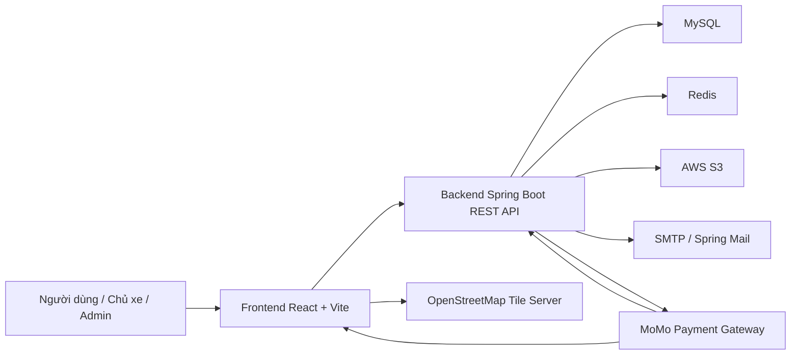
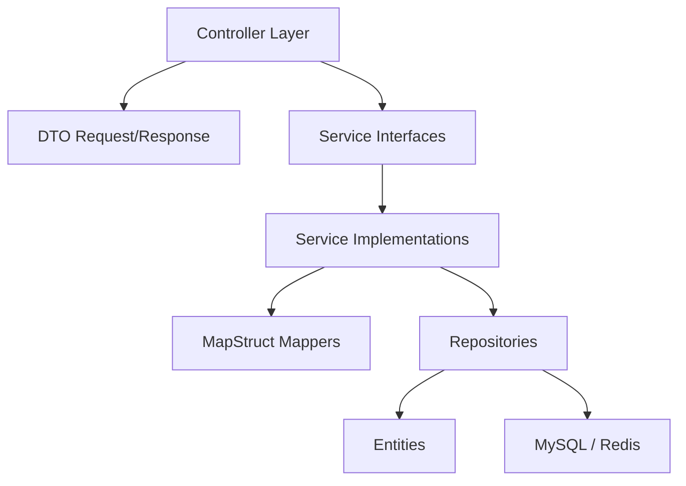
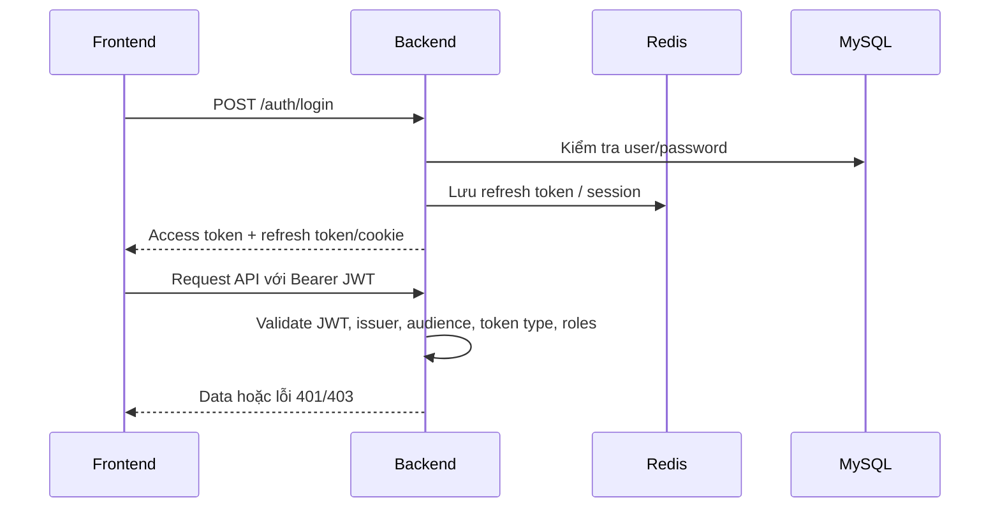
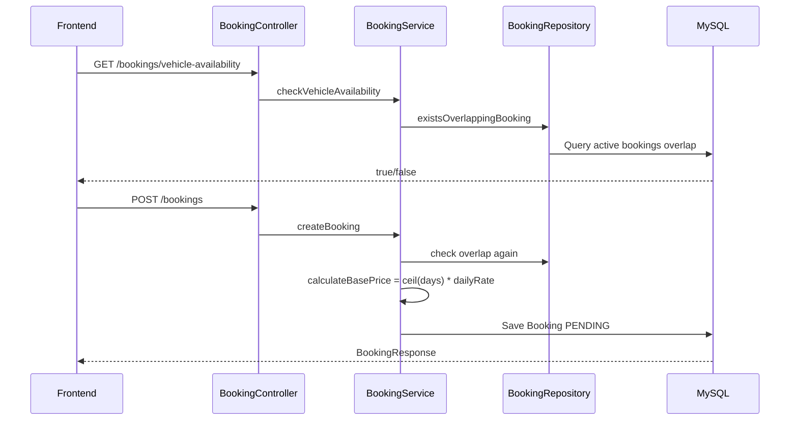
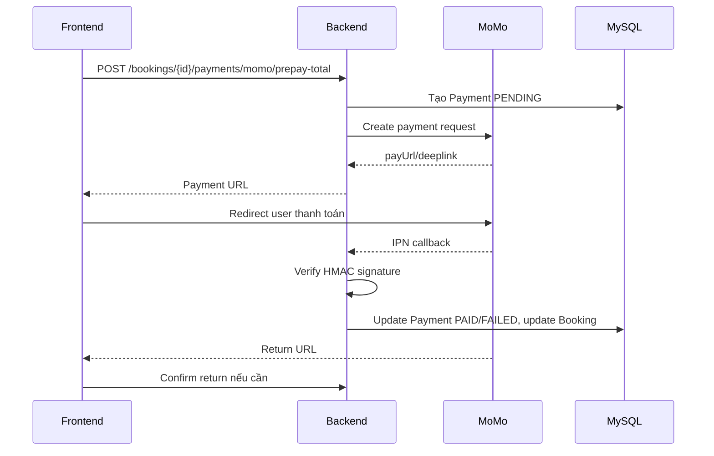
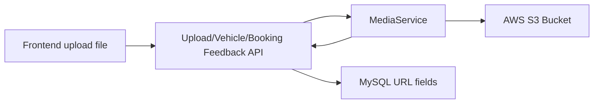
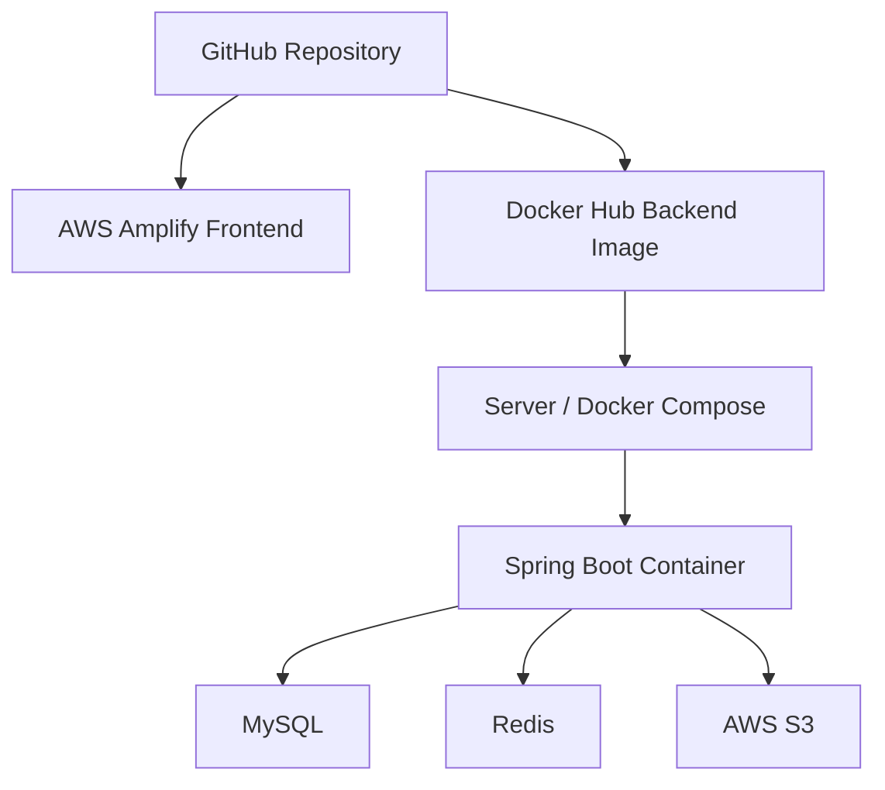

# Kiến Trúc Hệ Thống - Thuê Xe Ô Tô Tự Lái

Ngày tạo: 2026-05-23  
Website production: https://www.thuexeoto.online  
Repository hiện tại: mono-repo gồm backend Spring Boot và frontend React/Vite.

## 1. Mục Tiêu Hệ Thống

Hệ thống là nền tảng marketplace B2B/B2C cho thuê ô tô tự lái, phục vụ ba nhóm người dùng chính:

- Người thuê xe: tìm kiếm xe, xem chi tiết, đặt xe, thanh toán, theo dõi lịch sử, đánh giá sau chuyến đi.
- Chủ xe: gửi yêu cầu đăng xe, upload ảnh/tài liệu, theo dõi trạng thái duyệt, quản lý xe đã được duyệt.
- Admin: quản lý người dùng, xe, trạm, booking, thanh toán, yêu cầu chủ xe, feedback, blog và dashboard.

## 2. Tổng Quan Kiến Trúc


```mermaid
flowchart LR
    User["Người dùng / Chủ xe / Admin"]
    Browser["Frontend React + Vite"]
    API["Backend Spring Boot REST API"]
    MySQL["MySQL"]
    Redis["Redis"]
    S3["AWS S3"]
    Mail["SMTP / Spring Mail"]
    Momo["MoMo Payment Gateway"]
    OSM["OpenStreetMap Tile Server"]

    User --> Browser
    Browser --> API
    Browser --> OSM
    API --> MySQL
    API --> Redis
    API --> S3
    API --> Mail
    API --> Momo
    Momo --> API
    Momo --> Browser
```

Hệ thống đang đi theo mô hình SPA frontend gọi REST API backend. Backend chịu trách nhiệm xác thực, nghiệp vụ, phân quyền, lưu dữ liệu, tích hợp thanh toán, gửi mail và upload media.

## 3. Kiến Trúc Backend

Backend nằm trong `src/main/java/com/example/ungdunggoixe`.

```text
configuration/          Cấu hình Security, AWS, Redis, Swagger, Locale, Mail, MoMo
controller/             REST API endpoint
dto/request/            Request DTO
dto/response/           Response DTO
entity/                 JPA entities và Redis entities
repository/             Spring Data JPA/Redis repositories
repository/specification/ Search/filter specification
mapper/                 MapStruct mapper
service/                Service interface
service/implement/      Service implementation
exception/              ErrorCode, AppException, GlobalExceptionHandler
security/               JWT validator
constant/               Constants và enum sort field
scheduling/             Scheduled jobs
util/                   Utility helper
```

### 3.1 Layering


```mermaid
flowchart TB
    Controller["Controller Layer"]
    DTO["DTO Request/Response"]
    ServiceInterface["Service Interfaces"]
    ServiceImpl["Service Implementations"]
    Mapper["MapStruct Mappers"]
    Repository["Repositories"]
    Entity["Entities"]
    Database["MySQL / Redis"]

    Controller --> DTO
    Controller --> ServiceInterface
    ServiceInterface --> ServiceImpl
    ServiceImpl --> Mapper
    ServiceImpl --> Repository
    Repository --> Entity
    Repository --> Database
```

Đánh giá:

- Tách interface và implementation đã rõ, phù hợp maintainability.
- DTO và mapper giúp tránh expose entity trực tiếp ra API.
- Repository có dùng `Specification` và `EntityGraph` ở các phần cần search/filter/fetch relation.
- Một số service vẫn khá lớn, đặc biệt booking/payment/admin sections, nên về sau có thể tách nhỏ theo domain action.

### 3.2 Các Domain Chính

| Domain | Thành phần chính | Vai trò |
| --- | --- | --- |
| Auth/User | `AuthenticationService`, `UserService`, `TokenService`, `SecurityConfiguration` | Đăng ký, đăng nhập, Google OAuth, JWT, refresh token, hồ sơ user |
| Vehicle | `VehicleService`, `VehicleRepository`, `VehicleController` | Quản lý xe, xe public, upload ảnh xe |
| Station | `StationService`, `StationRepository` | Quản lý trạm, tọa độ bản đồ |
| Booking | `BookingService`, `BookingRepository`, `BookingSpecs` | Đặt xe, chống trùng lịch, status transition, phí phát sinh |
| Payment | `PaymentService`, `PaymentRepository`, `MomoController` | Payment record, MoMo prepay, topup/refund, confirm/fail |
| Owner Request | `OwnerVehicleRequestService`, `OwnerVehicleMediaService` | Chủ xe gửi yêu cầu, admin duyệt/từ chối/yêu cầu bổ sung |
| Feedback | `BookingFeedbackService`, `VehiclePublicFeedbackService`, `AdminBookingFeedbackService` | Đánh giá xe sau booking |
| Blog | `BlogPostService`, admin/public blog controllers | Quản lý bài viết, rich text, cover image |
| Admin Dashboard | `AdminDashboardService` | Thống kê overview/charts |
| Media | `MediaService`, `AwsConfiguration` | Upload/delete media trên S3 |
| Mail | `MailService` | Welcome email, payment success email, owner request review email |

## 4. Kiến Trúc Frontend

Frontend nằm trong `frontend/src`.

```text
api/              API clients, authFetch, DTO type frontend
components/       Component dùng lại: TopNav, modal, upload, rating
contexts/         AuthContext
hooks/            Custom hooks
lib/              Helper logic frontend
pages/            Page-level components
assets/           Ảnh static
```

### 4.1 Routing Chính

Các route chính nằm trong `frontend/src/App.tsx`:

| Route | Page | Vai trò |
| --- | --- | --- |
| `/` | `StudioXLandingPage` | Trang chủ |
| `/auth` | `AuthPage` | Đăng nhập/đăng ký |
| `/auth/google` | `GoogleOAuthCallbackPage` | Callback Google OAuth |
| `/rent` | `CarRentalPage` | Danh sách xe |
| `/rent/:id` | `VehicleDetailPage` | Chi tiết xe |
| `/booking/:vehicleId` | `VehicleBookingPage` | Đặt xe |
| `/payment/momo-return` | `MomoReturnPage` | Kết quả thanh toán MoMo |
| `/account` | `UserAccountPage` | Hồ sơ cá nhân |
| `/account/orders` | `UserOrderHistoryPage` | Lịch sử booking |
| `/owner/register-vehicle` | `OwnerRegisterVehiclePage` | Chủ xe đăng ký xe |
| `/owner/vehicle-requests` | `OwnerMyVehicleRequestsPage` | Danh sách yêu cầu chủ xe |
| `/admin` | `AdminDashboardPage` | Admin dashboard |
| `/blog` | `BlogListingPage` | Danh sách bài viết |
| `/mapstation` | `MapStationPage` | Bản đồ trạm |

### 4.2 API Layer

Frontend dùng `VITE_API_BASE`, mặc định là `/api`. Các API client chính:

- `auth.ts`
- `authFetch.ts`
- `users.ts`
- `vehicles.ts`
- `bookings.ts`
- `payments.ts`
- `ownerVehicleRequests.ts`
- `stations.ts`
- `blogPosts.ts`
- `adminDashboard.ts`
- `uploads.ts`

Đánh giá:

- Có API layer riêng là điểm tốt, dễ đổi endpoint hoặc response handling.
- `authFetch` giúp gom logic token/redirect.
- Một số API admin vẫn dùng `fetch` thay vì `authFetch`, nên cần rà lại để tránh thiếu Authorization ở các endpoint cần quyền admin.
- `API_BASE` đang khai báo lặp trong nhiều file; có thể gom thành một config helper duy nhất.

## 5. Luồng Xác Thực Và Phân Quyền


```mermaid
sequenceDiagram
    participant FE as Frontend
    participant BE as Backend
    participant Redis as Redis
    participant DB as MySQL

    FE->>BE: POST /auth/login
    BE->>DB: Kiểm tra user/password
    BE->>Redis: Lưu refresh token / session
    BE-->>FE: Access token + refresh token/cookie
    FE->>BE: Request API với Bearer JWT
    BE->>BE: Validate JWT, issuer, audience, token type, roles
    BE-->>FE: Data hoặc lỗi 401/403
```

Thành phần liên quan:

- `SecurityConfiguration`
- `JwtConfiguration`
- `CustomJwtValidator`
- `JwtPrincipalUtils`
- `AuthenticationServiceImplement`
- `TokenServiceImplement`
- Redis entities: `RefreshToken`, `BlacklistedToken`

Đánh giá:

- JWT có phân biệt access/refresh thông qua claim token type.
- Redis dùng để quản lý refresh token và blacklist access token.
- Cần đảm bảo production luôn có `JWT_SECRET`, `JWT_AUDIENCE`, issuer/domain đúng.

## 6. Luồng Booking


```mermaid
sequenceDiagram
    participant FE as Frontend
    participant BookingAPI as BookingController
    participant BookingService as BookingService
    participant Repo as BookingRepository
    participant DB as MySQL

    FE->>BookingAPI: GET /bookings/vehicle-availability
    BookingAPI->>BookingService: checkVehicleAvailability
    BookingService->>Repo: existsOverlappingBooking
    Repo->>DB: Query active bookings overlap
    DB-->>FE: true/false

    FE->>BookingAPI: POST /bookings
    BookingAPI->>BookingService: createBooking
    BookingService->>Repo: check overlap again
    BookingService->>BookingService: calculateBasePrice = ceil(days) * dailyRate
    BookingService->>DB: Save Booking PENDING
    DB-->>FE: BookingResponse
```

Điểm quan trọng:

- Tính tiền thuê cơ bản theo ngày (`dailyRate`).
- Phí phát sinh/trả trễ vẫn theo giờ (`hourlyRate`).
- Chống trùng lịch bằng `existsOverlappingBooking`.
- Booking có optimistic locking bằng `@Version`.
- Status transition chính: `PENDING -> CONFIRMED -> ONGOING -> COMPLETED`, có thể `CANCELLED` ở các bước phù hợp.

Rủi ro/cần cải thiện:

- Nên thêm unit test cho tính ngày làm tròn và phí trễ theo giờ.
- Có thể lưu thêm `rentalDays` vào booking để audit/tính toán minh bạch.
- Nên bổ sung transaction boundary rõ cho các thao tác booking + payment liên quan.

## 7. Luồng Thanh Toán


```mermaid
sequenceDiagram
    participant FE as Frontend
    participant BE as Backend
    participant Momo as MoMo
    participant DB as MySQL

    FE->>BE: POST /bookings/{id}/payments/momo/prepay-total
    BE->>DB: Tạo Payment PENDING
    BE->>Momo: Create payment request
    Momo-->>BE: payUrl/deeplink
    BE-->>FE: Payment URL
    FE->>Momo: Redirect user thanh toán
    Momo-->>BE: IPN callback
    BE->>BE: Verify HMAC signature
    BE->>DB: Update Payment PAID/FAILED, update Booking
    Momo-->>FE: Return URL
    FE->>BE: Confirm return nếu cần
```

Thành phần liên quan:

- `PaymentServiceImplement`
- `MomoController`
- `MomoServiceImplement`
- `MomoPrepaidBookingExpiryScheduler`
- `PaymentRepository`

Đánh giá:

- Có scheduler expire booking MoMo prepaid quá hạn để nhường slot xe.
- Có phân biệt payment purpose: prepaid total, topup, refund.
- Production config đã được chuyển sang env cho MoMo return URL, IPN URL, access key và secret key. Khi deploy cần bảo đảm `.env` EC2 có đủ các biến `MOMO_*`.

## 8. Luồng Upload Media


```mermaid
flowchart LR
    FE["Frontend upload file"]
    API["Upload/Vehicle/Booking Feedback API"]
    Media["MediaService"]
    S3["AWS S3 Bucket"]
    DB["MySQL URL fields"]

    FE --> API
    API --> Media
    Media --> S3
    Media --> API
    API --> DB
```

Các luồng upload:

- Ảnh xe.
- Tài liệu xe của owner.
- Giấy tờ xác minh user.
- Ảnh feedback booking.
- Cover blog.

Đánh giá:

- S3 là hướng đúng cho production.
- Text/comment cũ về Cloudinary và Google Maps đã được dọn ở các UI/comment chính; vẫn nên rà lại trước release.
- Nên có chính sách file validation nhất quán: type, size, folder ownership, delete old file.

## 9. Cache, Search, Pagination

Backend đang dùng:

- Redis cho session/token/cache.
- Spring Cache ở một số service như station.
- `JpaSpecificationExecutor` cho search/filter.
- `PageResponse<T>` cho response phân trang.
- Sort constants như `BookingSortField` để tránh hardcode sort path.

Đánh giá:

- Specification là hướng tốt cho admin filters.
- EntityGraph giúp giảm N+1 khi response cần renter/vehicle/station.
- Nên gom sort field constants cho tất cả domain có phân trang.

## 10. Deploy Hiện Tại


```mermaid
flowchart TB
    GitHub["GitHub Repository"]
    Amplify["AWS Amplify Frontend"]
    DockerHub["Docker Hub Backend Image"]
    Server["Server / Docker Compose"]
    Backend["Spring Boot Container"]
    MySQL["MySQL"]
    Redis["Redis"]
    S3["AWS S3"]

    GitHub --> Amplify
    GitHub --> DockerHub
    DockerHub --> Server
    Server --> Backend
    Backend --> MySQL
    Backend --> Redis
    Backend --> S3
```

Hiện trạng:

- Frontend deploy bằng AWS Amplify.
- Backend build Docker image và pull về server.
- MySQL/Redis chạy ở môi trường server.
- Media dùng AWS S3.

Cần chuẩn hóa:

- Document rõ branch deploy frontend.
- Document rõ tag Docker backend.
- Tách env dev/prod.
- Không để secret trong repo.

## 11. Review Tổng Thể Code

### Điểm mạnh

- Domain khá đầy đủ cho một sản phẩm thuê xe thật: auth, booking, payment, owner, admin, feedback, blog.
- Backend có cấu trúc layer rõ, dễ theo dõi.
- Frontend có API layer và page decomposition tương đối tốt.
- S3, Redis, MoMo, Mail, OAuth đã được tích hợp.
- Có README và deploy thực tế.

### Điểm cần cải thiện

- MoMo production config đã chuyển sang env, nhưng cần kiểm tra `.env` server trước mỗi lần deploy.
- Một số text/comment cũ đã được dọn, nhưng vẫn nên sweep định kỳ trước release.
- Test coverage còn mỏng so với độ quan trọng của booking/payment/auth.
- Header/layout public còn lặp giữa `TopNav` và page-specific nav.
- API base và response handling frontend còn lặp ở nhiều file.
- Một số service lớn nên tách nhỏ khi tính năng tiếp tục tăng.

## 12. Đề Xuất Kiến Trúc Tiếp Theo

### Ngắn hạn

- Kiểm tra production config: MoMo URL/secret trong `.env`, app domain, CORS.
- Sweep text/comment cũ bằng `rg "Cloudinary|Google Maps|demo|localhost"`.
- Thêm test cho booking/payment.
- Dọn UI public còn tiếng Anh nếu định hướng người dùng Việt Nam.

### Trung hạn

- Tạo `config/apiBase.ts` trong frontend để gom API base.
- Tạo `PublicLayout` dùng chung cho landing/rent/blog/map/account.
- Tách `PaymentDomainService` hoặc `BookingSettlementService` khỏi `BookingServiceImplement` nếu logic topup/refund tăng.
- Tạo `@ConfigurationProperties` cho app/momo/aws/jwt và validate config prod.

### Dài hạn

- Tách frontend/backend thành hai repo nếu team/deploy lifecycle khác nhau.
- Thêm observability: structured logs, health checks, payment audit logs.
- Thêm owner revenue dashboard và notification system.
- Thêm CI đầy đủ: backend test, frontend lint/build, Docker build, security scan.

## 13. Checklist Kiến Trúc Production

- [ ] Production không còn localhost trong public URL.
- [ ] Không còn secret trong source code.
- [ ] CORS chỉ allow domain thật.
- [ ] JWT audience/issuer đúng production.
- [ ] MoMo return URL và IPN URL trỏ đúng domain thật.
- [ ] S3 bucket policy phù hợp public read/private write.
- [ ] MySQL có backup.
- [ ] Redis có password và không public internet.
- [ ] Swagger UI được bảo vệ hoặc tắt trên production nếu cần.
- [ ] Critical flows có test: booking, payment, auth, upload.

## 14. Kết Luận

Kiến trúc hiện tại đủ tốt để phát triển tiếp thành sản phẩm thật: backend có domain rõ, frontend có route/API layer đầy đủ, deploy đã có nền tảng. Việc cần làm tiếp theo không phải viết thêm thật nhiều feature, mà là làm sạch production config, tăng test cho nghiệp vụ rủi ro cao, gom các phần lặp và chuẩn hóa tài liệu deploy. Sau khi hoàn thiện các điểm này, hệ thống sẽ dễ bảo trì, dễ demo và đáng tin cậy hơn khi vận hành.
