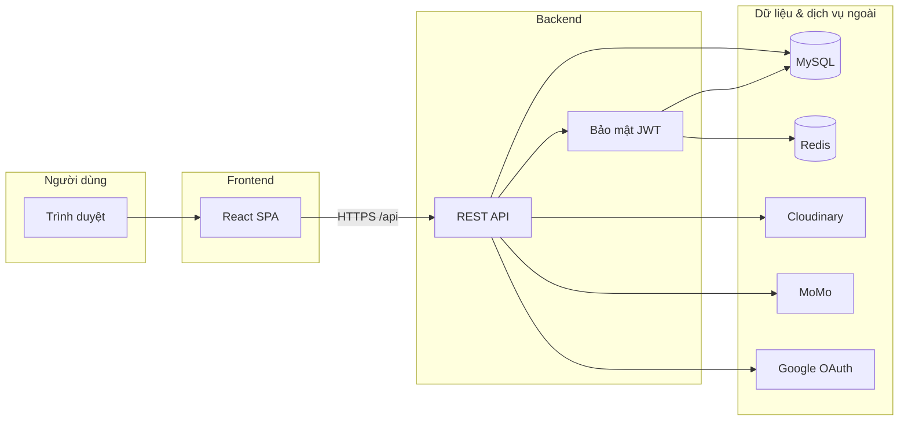
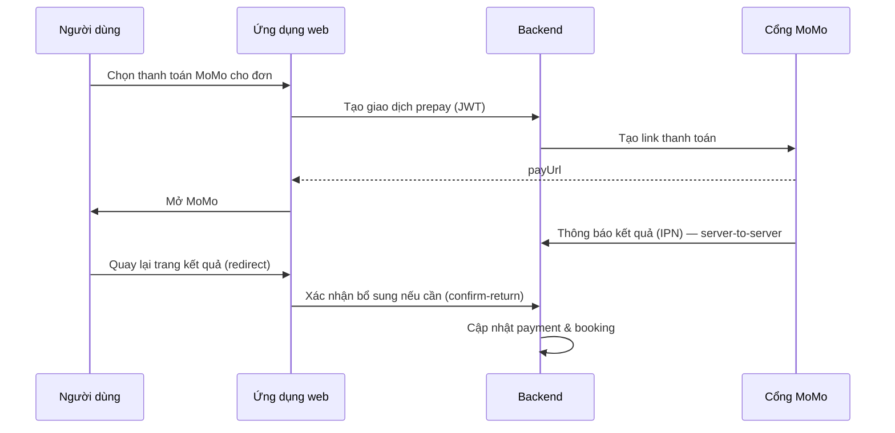

# UngDungGoiXe — Tài liệu giới thiệu & thuyết trình

**Đối tượng:** khách hàng, hội đồng, hoặc stakeholder **không cần** đọc mã nguồn.  
**Bổ sung:** [`plan.md`](./plan.md) (bối cảnh kỹ thuật), [`architecture.md`](./architecture.md) (sơ đồ & luồng chi tiết cho đội phát triển).

---

## 1. Sản phẩm là gì?

**Ứng dụng thuê xe (P2P / theo trạm)** trên nền web hiện đại:

- Người thuê tìm xe, đặt chỗ theo khung giờ, thanh toán (tiền mặt tại trạm hoặc **MoMo** trả trước tổng — tùy cấu hình nghiệp vụ).
- **Chủ xe** đăng ký phương tiện qua hồ sơ (ảnh, giấy tờ), admin duyệt.
- **Admin** quản trị trạm, xe, đơn, thanh toán, đánh giá.
- **Đánh giá** sau chuyến (sao, nhận xét, ảnh), hiển thị công khai trên trang xe để tăng tin cậy.

**Giá trị thể hiện:** một **full-stack** có luồng nghiệp vụ đóng — từ đăng ký, đặt xe, thanh toán tích hợp cổng, đến phản hồi khách hàng và quản trị.

---

## 2. Công nghệ (tầm nhìn tổng quan)

| Lớp | Công nghệ | Vai trò ngắn |
|-----|-----------|----------------|
| **Giao diện** | React, TypeScript, Vite | SPA nhanh, route rõ ràng (`/rent`, `/auth`, `/account`, `/admin`, …). |
| **API** | Spring Boot 4, Java 21 | REST chuẩn, bảo mật JWT, mô hình phân lớp (Controller → Service → DB). |
| **Dữ liệu** | MySQL + JPA | Lưu người dùng, xe, đơn, thanh toán, đánh giá. |
| **Phiên đăng nhập** | Redis | Refresh token an toàn, có thể thu hồi (logout / blacklist). |
| **Ảnh / tài liệu** | Cloudinary | Ảnh xe, giấy tờ chủ xe, ảnh đánh giá — URL công khai, không nhét file nặng vào DB. |
| **Thanh toán online** | MoMo (sandbox / production) | Trả trước tổng đơn; IPN + xác nhận sau redirect. |
| **Đăng nhập xã hội** | Google OAuth 2.0 | Đăng nhập bằng Google, cùng tài khoản nội bộ (JWT) với email/mật khẩu. |

---

## 3. Sơ đồ hệ thống (tổng thể)

**Dev:** frontend chạy cổng 5173, gọi API qua proxy `/api` → backend 8080 (khách hàng có thể coi là “một hệ thống”; triển khai thật có thể gộp domain hoặc CDN).

---

## 4. Điểm nổi bật (để nhấn mạnh khi thuyết trình)

1. **Bảo mật chủ động:** đăng nhập email/mật khẩu hoặc Google; **access token** ngắn hạn; **refresh token** trong cookie HttpOnly + Redis — giảm rủi ro lộ session.
2. **Luồng đặt xe & thanh toán rõ ràng:** kiểm tra chỗ trống theo thời gian, giá theo giờ, có nhánh **MoMo prepay** và xác nhận đơn sau khi tiền về.
3. **Đa vai trò:** khách thuê, chủ xe (hồ sơ + xe), admin — cùng một nền tảng, phân quyền theo JWT.
4. **Media chuyên nghiệp:** ảnh và tài liệu trên **Cloudinary** (CDN), có quy tắc folder và xóa an toàn khi thay file.
5. **Uy tín sau thuê:** đánh giá gắn **một booking đã hoàn thành**, cập nhật điểm trung bình xe, hiển thị công khai cho người xem tiếp theo.
6. **Mở rộng & vận hành:** API có Swagger; cấu hình tách env (JWT, DB, Redis, MoMo, Cloudinary, Google).

---

## 5. Các luồng hoạt động chính

### 5.1 Đăng nhập & phiên làm việc (email / mật khẩu)

**Mục đích:** người dùng đăng nhập một lần, gọi API được bảo vệ mà không gửi mật khẩu lặp lại.

1. Người dùng gửi email + mật khẩu → server xác thực (mật khẩu đã băm BCrypt).
2. Server trả **JWT access** (JSON) + đặt cookie **refresh** (HttpOnly).
3. Các request sau kèm header `Authorization: Bearer <access>`.
4. Khi access hết hạn, client tự gọi **làm mới token** bằng cookie refresh (rotation: refresh cũ vô hiệu sau một lần dùng).
5. **Đăng xuất:** xóa refresh trên server + đưa access vào danh sách chặn đến khi hết hạn.

**Ý nghĩa cho khách hàng:** mô hình giống các ứng dụng web lớn; có thể thu hồi phiên từ phía server.

---

### 5.2 Đăng nhập Google (OAuth 2.0 — authorization code)

**Mục đích:** đăng nhập nhanh bằng tài khoản Google, **không** lưu mật khẩu Google trên hệ thống.

1. Người dùng bấm “Google” → trình duyệt chuyển sang Google để đồng ý phạm vi (`openid`, `email`, `profile`).
2. Google chuyển về trang **`/auth/google`** của app kèm **mã `code`** (và `state` chống giả mạo).
3. Frontend gửi `code` + **redirect URI** khớp cấu hình Google → backend.
4. Backend **đổi `code` lấy token** (có **client secret** chỉ trên server), **kiểm tra `id_token`**, email đã xác minh.
5. Hệ thống **tìm hoặc tạo** user → phát **cùng loại JWT + refresh cookie** như đăng nhập thường.

**Điểm nổi bật kỹ thuật:** secret không bao giờ nằm trên trình duyệt; client ID có thể lấy từ env frontend **hoặc** endpoint công khai do backend cung cấp (tiện cấu hình IntelliJ chỉ cho server).

---

### 5.3 Đặt xe (booking)

**Mục đích:** đặt xe theo khung giờ, tránh trùng lịch cùng một xe.

1. Khách chọn xe, trạm, giờ nhận / trả dự kiến.
2. Hệ thống kiểm tra **availability** (API công khai cho bước tra cứu).
3. Tạo **booking** với trạng thái ban đầu (ví dụ chờ xác nhận / chờ cọc — tùy quy tắc đã cài).
4. Trạng thái đơn có **vòng đời** (ví dụ: chờ → đã xác nhận → đang thuê → hoàn thành / hủy); logic tập trung ở tầng dịch vụ để đảm bảo nhất quán.

**Ý cho thuyết trình:** minh bạch giá (theo giờ), có thể gắn chính sách cọc / prepay.

---

### 5.4 Thanh toán MoMo (trả trước tổng — prepay)

**Mục đích:** người thuê thanh toán online một phần/tổng theo chính sách; hệ thống cập nhật trạng thái thanh toán và đơn.

**Lưu ý vận hành:** IPN yêu cầu URL **public**; môi trường dev máy cá nhân thường dùng thêm **xác nhận sau redirect** để đồng bộ khi IPN chưa tới.

---

### 5.5 Ảnh & tài liệu trên Cloudinary

**Mục đích:** lưu ảnh xe, giấy tờ P2P, ảnh đánh giá — **nhanh, CDN, không làm phình DB.**

1. Người dùng upload file → API nhận multipart.
2. Backend gọi **Cloudinary** theo **folder** cố định (ví dụ `vehicles/{id}`, `owner-vehicles/{user}/…`, `bookings/{id}/feedback`).
3. Chỉ lưu **URL HTTPS** trong database.
4. Khi thay/xóa URL hợp lệ, có thể **xóa asset** trên Cloudinary (kiểm tra host & cloud đúng cấu hình để tránh xóa nhầm link ngoài).

---

### 5.6 Đánh giá sau chuyến (feedback)

**Mục đích:** chỉ khách **đã hoàn thành** chuyến mới đánh giá; **một booking — tối đa một feedback.**

1. Upload ảnh kèm (lên Cloudinary) → nhận URL.
2. Gửi điểm sao, nhận xét, danh sách URL ảnh (server validate URL thuộc đúng cloud/path).
3. Lưu feedback, **cập nhật điểm trung bình** trên xe.
4. Trang chi tiết xe **đọc công khai** danh sách đánh giá (phân trang); admin có màn hình tổng hợp.

---

### 5.7 Chủ xe & quản trị (rút gọn)

- **Chủ xe:** gửi hồ sơ xe + giấy tờ; sau duyệt có thể quản lý xe đã gắn với hồ sơ.
- **Admin:** quản trị trạm, xe, đơn, thanh toán, phản hồi — phân quyền qua JWT (role).

---

## 6. Kết luận thuyết trình (gợi ý)

- Hệ thống **đủ luồng** cho một nền tảng thuê xe hiện đại: **danh tính**, **đặt chỗ**, **tiền**, **uy tín sau dịch vụ**, **quản trị**.
- Kiến trúc **tách frontend / backend** giúp **mở rộng** (app mobile sau này có thể dùng chung API) và **bảo trì** theo module.

---

## 7. Tài liệu chi tiết trong repo

| File | Nội dung |
|------|-----------|
| [`introduce-dev.md`](./introduce-dev.md) | **Onboarding developer:** luồng code, class chính, env, lệnh chạy — giới thiệu với dev khác. |
| [`plan.md`](./plan.md) | Stack, route FE, quy tắc API ngắn. |
| [`architecture.md`](./architecture.md) | Sơ đồ C4, JWT, Google OAuth, Cloudinary, MoMo, feedback — **chi tiết kiến trúc**. |
| [`plan2.md`](./plan2.md) | Roadmap / việc tiếp theo. |

*Bản `introduce.md` này có thể chỉnh sửa trực tiếp cho slide hoặc kịch bản nói — giữ link tới tài liệu sâu khi khách hàng cần due diligence kỹ thuật.*
